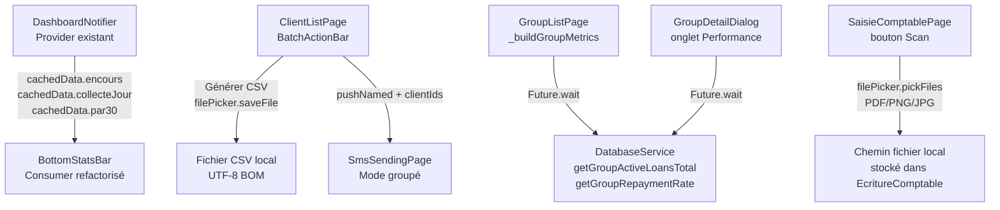

# Design Document

> **Titre :** Phase 2 — Corrections UI & Données Réelles — SIGMA Micro-Finance

## Overview

La Phase 2 consiste à brancher cinq zones de l'UI sur des données réelles, en remplaçant les placeholders identifiés lors de l'audit. Les modifications sont ciblées et sans refactoring architectural :

1. **`BottomStatsBar`** → consomme `DashboardNotifier` via Provider.
2. **Export CSV clients** → génère un vrai CSV via `dart:convert` + `file_picker`.
3. **SMS groupé** → navigue vers `SmsSendingPage` avec pré-sélection.
4. **Groupes — encours et taux** → appels `DatabaseService` en parallèle.
5. **Bouton Scan comptabilité** → ouvre `file_picker` et stocke le chemin.

Aucun nouveau service, aucune nouvelle couche. On exploite uniquement l'infrastructure existante (`DashboardNotifier`, `DatabaseService`, `GroupApiService`, `file_picker`).

---

## Architecture



---

## Components and Interfaces

### 1. `BottomStatsBar` — Consumer Provider

**Fichier :** `lib/widgets/bottom_stats_bar.dart`

La `BottomStatsBar` devient un `StatelessWidget` qui consomme `DashboardNotifier` via `Consumer`. Elle n'appelle plus `DatabaseService` directement — elle lit le cache déjà chargé par le Dashboard.

```dart
class BottomStatsBar extends StatelessWidget {
  const BottomStatsBar({super.key});

  @override
  Widget build(BuildContext context) {
    return Consumer<DashboardNotifier>(
      builder: (context, notifier, _) {
        final data = notifier.cachedData;
        final encours   = data != null ? _formatFcfa(data.encours)     : '--';
        final collecte  = data != null ? _formatFcfa(data.collecteJour) : '--';
        final par       = data != null ? '${data.par30.toStringAsFixed(1)}%' : '--';
        // ... chips inchangés, seulement les valeurs deviennent dynamiques
      },
    );
  }

  String _formatFcfa(double value) {
    if (value >= 1_000_000) return '${(value / 1_000_000).toStringAsFixed(2)} M';
    if (value >= 1_000)     return '${(value / 1_000).toStringAsFixed(0)} K';
    return value.toStringAsFixed(0);
  }
}
```

**Dépendance** : `DashboardNotifier` doit déjà être injecté dans le `MultiProvider` de `main.dart` (fait en Phase 3). La `BottomStatsBar` est rendue dans `MainLayout` — elle est donc bien dans l'arbre Provider.

**DashboardData à vérifier** : s'assurer que le modèle `DashboardData` expose bien `encours`, `collecteJour`, `par30` (doublevérification dans `lib/models/dashboard_data.dart`).

---

### 2. Export CSV clients — `ClientListPage`

**Fichier :** `lib/screens/clients/client_list_page.dart`

**Dépendances à ajouter dans `pubspec.yaml`** :
```yaml
file_picker: ^8.1.2   # déjà présent si Phase 5 est faite — vérifier
```

**Méthode `_exportSelectedClients()` à ajouter dans `_ClientListPageState`** :

```dart
Future<void> _exportSelectedClients(List<Client> allClients) async {
  final selected = allClients.where((c) => _selectedClientIds.contains(c.id)).toList();
  
  // 1. Construire le CSV (UTF-8 BOM pour Excel)
  final buffer = StringBuffer();
  buffer.writeln('\uFEFFN° Client,Nom,Prénoms,Téléphone,Risque,Score,Statut');
  for (final c in selected) {
    buffer.writeln(
      '"${c.numeroClient}","${c.nom}","${c.prenoms}",'
      '"${c.telephone ?? ''}","${c.niveauRisque.label}",'
      '${c.scoreCredit},"${c.statut.label}"',
    );
  }
  final csvBytes = utf8.encode(buffer.toString());
  
  // 2. Sauvegarder via file_picker
  final date = DateFormat('yyyy-MM-dd').format(DateTime.now());
  final path = await FilePicker.platform.saveFile(
    dialogTitle: 'Enregistrer l\'export clients',
    fileName: 'clients_export_$date.csv',
    type: FileType.custom,
    allowedExtensions: ['csv'],
    bytes: Uint8List.fromList(csvBytes),
  );
  
  if (path == null) return; // Annulé par l'utilisateur
  
  if (mounted) {
    ScaffoldMessenger.of(context).showSnackBar(
      SnackBar(content: Text('Export réussi : ${selected.length} clients exportés')),
    );
    setState(() { _isSelectionMode = false; _selectedClientIds.clear(); });
  }
}
```

**Remplacement dans `_buildBatchActionBar()`** : le `TextButton` « Exporter » appelle `_exportSelectedClients(clients)` au lieu du `SnackBar` simulé. La variable `clients` est accessible via le snapshot du `FutureBuilder` — il faudra la passer en paramètre à `_buildBatchActionBar(context, clients)`.

---

### 3. SMS groupé — Navigation vers `SmsSendingPage`

**Fichier :** `lib/screens/clients/client_list_page.dart` + `lib/screens/communications/sms_sending_page.dart`

**Modification dans `ClientListPage`** :

Le bouton SMS de `_buildBatchActionBar` navigue vers `SmsSendingPage` en passant les IDs :

```dart
TextButton.icon(
  onPressed: () {
    final ids = _selectedClientIds.toList();
    Navigator.of(context).push(
      MaterialPageRoute(
        builder: (_) => SmsSendingPage(preSelectedClientIds: ids),
      ),
    );
  },
  icon: const Icon(Icons.sms_rounded),
  label: const Text('SMS'),
),
```

**Modification dans `SmsSendingPage`** :

```dart
class SmsSendingPage extends StatefulWidget {
  final List<int> preSelectedClientIds; // Nouveau paramètre optionnel
  const SmsSendingPage({super.key, this.preSelectedClientIds = const []});
  // ...
}
```

Dans `_loadData()`, après le chargement des clients, pré-sélectionner :
- Si `preSelectedClientIds.length == 1` → `_selectedClient = clients.firstWhere(id == preSelectedClientIds[0])`
- Si `preSelectedClientIds.length > 1` → activer `_isBulkMode = true` et peupler `_bulkClients`

**Mode envoi groupé (`_isBulkMode`)** :
- Afficher une liste non modifiable des destinataires
- Le bouton envoyer itère sur `_bulkClients` et appelle `_sendSms(client)` pour chacun
- Afficher un résumé en `SnackBar` : `'SMS envoyés : 3/3'` ou `'SMS : 2/3 réussis'`

---

### 4. Métriques dynamiques des groupes — `GroupListPage`

**Fichier :** `lib/screens/groupes/group_list_page.dart`

**Nouvelles méthodes dans `DatabaseService`** (à ajouter dans `lib/core/services/database_service.dart`) :

```dart
/// Retourne la somme des capitaux restants dus des prêts actifs
/// des membres d'un groupe.
Future<double> getGroupActiveLoansTotal(int groupId) async {
  final db = await database;
  final result = await db.rawQuery('''
    SELECT COALESCE(SUM(p.capital_restant), 0.0) AS total
    FROM prets p
    INNER JOIN clients c ON c.id = p.client_id
    WHERE c.groupe_solidaire_id = ?
      AND p.statut IN ('ACTIF', 'EN_RETARD')
  ''', [groupId]);
  return (result.first['total'] as num?)?.toDouble() ?? 0.0;
}

/// Retourne le taux de remboursement (0-100) du groupe.
/// Calcul : sum(remboursements.montant_paye) / sum(echeanciers.montant_du) * 100
Future<double?> getGroupRepaymentRate(int groupId) async {
  final db = await database;
  final result = await db.rawQuery('''
    SELECT 
      SUM(e.montant_du)   AS total_du,
      SUM(e.montant_paye) AS total_paye
    FROM echeanciers e
    INNER JOIN prets p ON p.id = e.pret_id
    INNER JOIN clients c ON c.id = p.client_id
    WHERE c.groupe_solidaire_id = ?
  ''', [groupId]);
  
  final totalDu    = (result.first['total_du']   as num?)?.toDouble() ?? 0.0;
  final totalPaye  = (result.first['total_paye'] as num?)?.toDouble() ?? 0.0;
  
  if (totalDu <= 0) return null; // Pas de prêts → retourner null
  return (totalPaye / totalDu) * 100;
}

/// Retourne la liste des prêts actifs des membres d'un groupe.
Future<List<Map<String, dynamic>>> getGroupLoans(int groupId) async {
  final db = await database;
  return await db.rawQuery('''
    SELECT p.id, p.numero_contrat, c.nom, c.prenoms,
           p.montant_accorde, p.capital_restant, p.statut, p.jours_retard
    FROM prets p
    INNER JOIN clients c ON c.id = p.client_id
    WHERE c.groupe_solidaire_id = ?
    ORDER BY p.date_deblocage DESC
  ''', [groupId]);
}
```

**Refactoring de `_buildGroupMetrics()` dans `GroupListPage`** :

```dart
Widget _buildGroupMetrics(GroupeSolidaire group) {
  return FutureBuilder<List<dynamic>>(
    future: Future.wait([
      DatabaseService().getGroupActiveLoansTotal(group.id!),
      DatabaseService().getGroupRepaymentRate(group.id!),
      ClientApiService().getGroupMembers(group.id!),
    ]),
    builder: (context, snapshot) {
      final memberCount = (snapshot.data?[2] as List?)?.length ?? 0;
      final encours     = (snapshot.data?[0] as double?) ?? 0.0;
      final tauxRate    = snapshot.data?[1] as double?;
      
      final encoursFmt = encours >= 1_000_000
          ? '${(encours / 1_000_000).toStringAsFixed(1)} M'
          : '${encours.toStringAsFixed(0)}';
      
      final tauxColor = tauxRate == null ? null
          : (tauxRate >= 90 ? AppColors.success
             : tauxRate >= 70 ? AppColors.warning
             : AppColors.error);
      final tauxFmt = tauxRate == null ? 'N/A' : '${tauxRate.round()}%';

      return Row(
        mainAxisAlignment: MainAxisAlignment.spaceBetween,
        children: [
          _buildMetricItem('MEMBRES', memberCount.toString()),
          _buildMetricItem('ENCOURS', encoursFmt),
          _buildMetricItem('PERF.', tauxFmt, color: tauxColor),
        ],
      );
    },
  );
}
```

---

### 5. Onglet Performance du `GroupDetailDialog`

**Fichier :** `lib/widgets/dialogs/group_detail_dialog.dart`

Remplacer les placeholders hardcodés de `_buildPerformanceTab()` et `_buildLoansTab()` par des données réelles :

```dart
Widget _buildPerformanceTab() {
  return FutureBuilder<List<dynamic>>(
    future: Future.wait([
      DatabaseService().getGroupActiveLoansTotal(_group.id!),
      DatabaseService().getGroupRepaymentRate(_group.id!),
      DatabaseService().getGroupLoans(_group.id!),
    ]),
    builder: (context, snapshot) {
      final encours   = (snapshot.data?[0] as double?) ?? 0.0;
      final taux      = snapshot.data?[1] as double?;
      final loans     = (snapshot.data?[2] as List?) ?? [];
      final months    = DateTime.now().difference(_group.dateCreation).inDays ~/ 30;
      
      return _buildTabContainer([
        _buildSectionHeader('Performance & Indicateurs', Icons.analytics_rounded),
        _buildInfoGrid([
          _buildInfoItem('Taux remboursement', taux != null ? '${taux.round()}%' : '—'),
          _buildInfoItem('Ancienneté du groupe', '$months mois'),
          _buildInfoItem('Encours total', '${(encours / 1000).toStringAsFixed(0)} K FCFA'),
          _buildInfoItem('Prêts actifs', '${loans.length} dossiers'),
        ]),
        // ... reste du tab
      ]);
    },
  );
}
```

---

### 6. Bouton Scan — `SaisieComptablePage`

**Fichier :** `lib/screens/comptabilite/saisie_comptable_page.dart`

**Ajout d'état dans `_SaisieComptablePageState`** :
```dart
String? _attachedFilePath;   // chemin absolu du fichier attaché
String? _attachedFileName;   // nom du fichier affiché
```

**Remplacement du bouton Scan** :

```dart
ElevatedButton.icon(
  onPressed: _pickAttachment,
  icon: const Icon(Icons.attach_file_rounded),
  label: const Text('Pièce jointe'),
  // ...
),
```

**Méthode `_pickAttachment()`** :

```dart
Future<void> _pickAttachment() async {
  final result = await FilePicker.platform.pickFiles(
    type: FileType.custom,
    allowedExtensions: ['pdf', 'png', 'jpg', 'jpeg'],
    withData: false,
    withReadStream: false,
  );
  
  if (result == null) return; // Annulé
  
  final file = result.files.single;
  final sizeKo = (file.size / 1024).round();
  
  if (file.size > 10 * 1024 * 1024) {
    ScaffoldMessenger.of(context).showSnackBar(
      const SnackBar(content: Text('Fichier volumineux (> 10 Mo) — l\'import peut être lent.')),
    );
  }
  
  setState(() {
    _attachedFilePath = file.path;
    _attachedFileName = '📎 ${file.name} (${sizeKo} Ko)';
  });
}
```

**Affichage du fichier attaché** sous le bouton :

```dart
if (_attachedFileName != null)
  Row(
    children: [
      Expanded(child: Text(_attachedFileName!, style: TextStyle(fontSize: 12, color: Colors.grey))),
      IconButton(
        icon: const Icon(Icons.close_rounded, size: 16),
        onPressed: () => setState(() { _attachedFilePath = null; _attachedFileName = null; }),
      ),
    ],
  ),
```

**Dans `_validateAndSave()`** : passer `_attachedFilePath` dans la construction de `EcritureComptable`. Si le champ `piecesJointes` n'existe pas dans le modèle, l'ajouter comme `String? piecesJointes`.

---

## Data Models

### Modifications de `EcritureComptable`

Ajouter le champ optionnel si absent :

```dart
// lib/models/ecriture_comptable_model.dart
class EcritureComptable {
  // ... champs existants
  final String? piecesJointes; // Chemin absolu du fichier attaché (nullable)
}
```

Vérifier que `fromMap()` et `toMap()` incluent `piecesJointes`.

### `DashboardData` — champs à vérifier

Confirmer que `lib/models/dashboard_data.dart` expose :
- `double encours` (encours total portefeuille)
- `double collecteJour` (collecte du jour)
- `double par30` (PAR > 30 jours en %)

Si ces champs sont absents ou sous un autre nom, les mapper dans `BottomStatsBar`.

---

## Correctness Properties

### Propriété 1 : Cohérence BottomStatsBar ↔ DashboardNotifier

*Pour toute valeur `encours` exposée par `DashboardNotifier.cachedData`, la `BottomStatsBar` doit afficher exactement cette valeur formatée (à la précision de formatage près), sans jamais afficher `'15.45 M'` si le notifier a une valeur différente.*

**Valide : Exigences 1.2, 1.6**

### Propriété 2 : Export CSV — tout client sélectionné est présent dans le CSV

*Pour tout ensemble S de clients sélectionnés dans `ClientListPage`, chaque client de S doit avoir exactement une ligne dans le CSV généré — ni plus, ni moins.*

**Valide : Exigences 2.1, 2.2**

### Propriété 3 : Export CSV — les colonnes sont conformes

*Pour tout CSV généré, la première ligne doit être exactement `N° Client,Nom,Prénoms,Téléphone,Risque,Score,Statut` et chaque ligne de données doit avoir exactement 7 champs.*

**Valide : Exigence 2.1**

### Propriété 4 : Encours groupe ≥ 0

*Pour tout groupe G, `getGroupActiveLoansTotal(G.id)` doit retourner une valeur ≥ 0.0 — jamais une valeur négative ni une exception.*

**Valide : Exigences 4.1, 4.3**

### Propriété 5 : Taux de remboursement ∈ [0, 100] ou null

*Pour tout groupe G, `getGroupRepaymentRate(G.id)` doit retourner soit `null` (pas de prêts), soit une valeur dans [0.0, 100.0]. Une valeur > 100 est invalide (paiements > dû).*

**Valide : Exigences 5.1, 5.6**

### Propriété 6 : Pas de fichier attaché invalide persisté

*Si l'utilisateur annule le sélecteur de fichier, `_attachedFilePath` doit rester `null` ou conserver sa valeur précédente inchangée. Aucun chemin `null` ou vide ne doit être passé à `EcritureComptable`.*

**Valide : Exigences 7.4, 7.3**

---

## Error Handling

| Situation | Comportement attendu |
|---|---|
| `DashboardNotifier.cachedData == null` | `BottomStatsBar` affiche `'--'` — pas d'exception |
| `FilePicker.saveFile()` retourne `null` (annulé) | Aucune action, aucun SnackBar |
| Écriture disque CSV échoue | SnackBar `'Erreur lors de l\'export : [message]'` |
| `getGroupActiveLoansTotal()` lève une exception SQLite | Retourner `0.0` depuis un try/catch interne |
| `getGroupRepaymentRate()` division par zéro | Retourner `null` si `totalDu <= 0` |
| `FilePicker.pickFiles()` retourne `null` | Conserver l'état précédent sans afficher d'erreur |
| Fichier attaché > 10 Mo | SnackBar d'avertissement non bloquant |

---

## Testing Strategy

### Tests unitaires

- `BottomStatsBar` : vérifier que `Consumer<DashboardNotifier>` affiche les valeurs du notifier
- `_exportSelectedClients()` : cas 0 sélection (guard), cas 1 client, cas N clients — vérifier structure CSV
- `getGroupActiveLoansTotal()` : base vide → 0.0 ; un prêt actif → bon total ; prêt clôturé → ignoré
- `getGroupRepaymentRate()` : base vide → null ; 100% payé → 100 ; 0% payé → 0
- `_pickAttachment()` : annulé → `_attachedFilePath` null ; fichier sélectionné → nom affiché

### Tests de propriétés (property-based)

La bibliothèque recommandée est `dart_check` ou `fast_check`.

**Test P1 — Cohérence BottomStatsBar ↔ DashboardNotifier**
```
Tag: Feature: phase2-ui-corrections, Property 1: BottomStatsBar consistency
Pour toute valeur double positive (encours) injectée dans DashboardNotifier,
vérifier que la BottomStatsBar affiche une représentation formatée non vide
et différente de '--'.
```

**Test P2 — CSV contient tous les clients sélectionnés**
```
Tag: Feature: phase2-ui-corrections, Property 2: CSV completeness
Pour tout sous-ensemble S de clients (1 à 50 éléments) générés aléatoirement,
vérifier que le CSV produit contient exactement len(S) lignes de données
(hors en-tête) et que chaque ligne correspond à un client de S.
```

**Test P4/P5 — Invariants DatabaseService groupes**
```
Tag: Feature: phase2-ui-corrections, Property 4/5: group metrics invariants
Pour tout ensemble de prêts générés aléatoirement (montants positifs, statuts variés),
vérifier que getGroupActiveLoansTotal() >= 0 et que getGroupRepaymentRate()
est dans [0, 100] ou null.
```

### Tests d'intégration

- `getGroupLoans()` : requête SQL sur base en mémoire avec données de test
- Navigation SMS groupé : vérifier que `SmsSendingPage` reçoit les bons `preSelectedClientIds`
