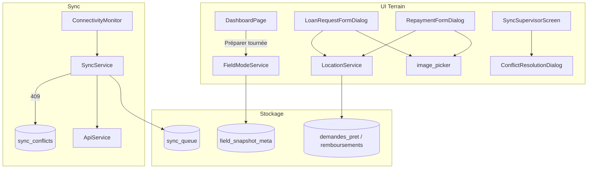

# Document de Conception — Phase 5 : Mode Terrain & Synchronisation

## Vue d'ensemble

La Phase 5 étend le système offline existant avec quatre briques complémentaires. L'approche reste chirurgicale : nouveaux services isolés, migrations SQLite incrémentales, modifications ciblées des formulaires terrain déjà présents.

**Prérequis livrés** (spec `sync-offline-online`, ne pas réimplémenter) :
- `SyncService`, `ConnectivityMonitor`, `SyncStatusBadge`, `SyncSupervisorScreen`
- Table `sync_queue` (v29)

**Migration cible :** SQLite v30 → v31

---

## 1. FieldModeService — Snapshot matinal

### 1.1 Nouveau fichier `lib/core/services/field_mode_service.dart`

```dart
class FieldModeService {
  static final FieldModeService _instance = FieldModeService._internal();
  factory FieldModeService() => _instance;

  /// true si un snapshot valide existe pour la date du jour.
  Future<bool> get isFieldModeActive;

  /// Télécharge et met en cache les données de tournée.
  /// Retourne FieldSnapshotResult { success, usedCache, counts }.
  Future<FieldSnapshotResult> prepareMorningSnapshot();

  /// Dernière date de snapshot (null si jamais préparé).
  Future<DateTime?> getLastSnapshotDate();
}
```

### 1.2 Données téléchargées

| Entité | Source online | Cache SQLite |
|--------|---------------|--------------|
| Clients portefeuille | `GET /clients?agent={username}` | `upsertClient()` |
| Échéances du jour | `GET /remboursements/echeances/jour` | table `echeanciers` |
| Demandes actives | `GET /prets/demandes?statut=active` | table `demandes_pret` |

En mode offline, `prepareMorningSnapshot()` lit le dernier snapshot si `created_at` < 24 h.

### 1.3 Table `field_snapshot_meta`

```sql
CREATE TABLE IF NOT EXISTS field_snapshot_meta (
  id INTEGER PRIMARY KEY AUTOINCREMENT,
  agent_id TEXT NOT NULL,
  snapshot_date TEXT NOT NULL,  -- yyyy-MM-dd
  created_at TEXT NOT NULL,
  client_count INTEGER DEFAULT 0,
  schedule_count INTEGER DEFAULT 0,
  request_count INTEGER DEFAULT 0
);
```

### 1.4 UI

- Bouton « Préparer ma tournée » dans `DashboardPage` (visible si rôle agent)
- Widget `FieldModeBanner` dans `main_layout.dart` app bar quand `isFieldModeActive`

---

## 2. Résolution de conflits

### 2.1 Table `sync_conflicts`

```sql
CREATE TABLE IF NOT EXISTS sync_conflicts (
  id TEXT PRIMARY KEY,
  sync_queue_id TEXT NOT NULL,
  entity_type TEXT NOT NULL,       -- 'client' | 'remboursement'
  entity_id TEXT,
  local_payload TEXT NOT NULL,
  server_payload TEXT NOT NULL,
  local_updated_at TEXT,
  server_updated_at TEXT,
  resolution TEXT NOT NULL DEFAULT 'pending',
  created_at TEXT NOT NULL
);
```

### 2.2 Modification `SyncService.flushPendingOperations()`

```
Réponse HTTP:
  2xx  → status='success' (inchangé)
  409  → INSERT sync_conflicts, status='conflict' (nouveau statut)
         Si LWW auto applicable → résoudre sans UI
  4xx (autre) → status='failed' (inchangé)
  5xx / timeout → retry (inchangé)
```

### 2.3 ConflictResolutionDialog

Fichier : `lib/widgets/dialogs/conflict_resolution_dialog.dart`

Affichage côte à côte :
- Colonne gauche : données locales (JSON parsé, champs métier)
- Colonne droite : données serveur
- Boutons : « Garder local » | « Garder serveur » | « Annuler »

### 2.4 Extension backend minimale

Dans `backend/app/routers/clients.py` et `remboursements.py` :
- Vérifier `updated_at` du body vs enregistrement PostgreSQL
- Si obsolète → `HTTPException(status_code=409, detail={ server_payload, server_updated_at })`

---

## 3. LocationService — GPS

### 3.1 Nouveau fichier `lib/core/services/location_service.dart`

```dart
class LocationService {
  Future<bool> hasPermission();
  Future<bool> requestPermission();
  Future<GeoPosition?> getCurrentPosition({Duration timeout = const Duration(seconds: 10)});
}
```

Wrapper autour de `geolocator` :
- `Geolocator.checkPermission()` / `requestPermission()`
- `Geolocator.getCurrentPosition(locationSettings: LocationSettings(accuracy: LocationAccuracy.high))`

### 3.2 Colonnes migration v31

```sql
ALTER TABLE demandes_pret ADD COLUMN latitude_visite REAL;
ALTER TABLE demandes_pret ADD COLUMN longitude_visite REAL;
ALTER TABLE remboursements ADD COLUMN latitude REAL;
ALTER TABLE remboursements ADD COLUMN longitude REAL;
ALTER TABLE remboursements ADD COLUMN photo_justificatif_path TEXT;
```

### 3.3 Points d'intégration

| Écran | Action |
|-------|--------|
| `LoanRequestFormDialog._buildVisiteStep()` | `initState` ou `onStepEntered` → capture GPS + affichage coords |
| `RepaymentFormDialog._submit()` | capture GPS avant insert |
| `ClientFormDialog` étape contact | bouton « Utiliser ma position » |

---

## 4. Photos terrain

### 4.1 LoanRequestFormDialog — photos visite

Remplacer la zone statique par :
```dart
// Liste _visitPhotoPaths (max 3)
// Boutons caméra + galerie (pattern ClientFormDialog._pickPhoto)
// Stockage: {appDocDir}/visites/{tempId}/ puis renommage après insert
// Persistance: photos_visite = paths.join(',')
```

### 4.2 RepaymentFormDialog — photo justificative

```dart
String? _justificatifPath;
// Section optionnelle avec aperçu miniature
// Copie vers {appDocDir}/collectes/{repaymentId}.jpg après insertRepayment
```

### 4.3 Contraintes plateforme

| Plateforme | Caméra | Galerie |
|------------|--------|---------|
| Android / iOS | ✅ | ✅ |
| Windows Desktop | ❌ (désactivé) | ✅ via `image_picker` |

---

## 5. Architecture globale Phase 5



---

## 6. Ordre d'implémentation recommandé

1. Migration v31 + modèles (fondation)
2. `LocationService` + intégration GPS (indépendant)
3. Photos terrain (indépendant, réutilise image_picker)
4. `FieldModeService` + UI snapshot (dépend ApiService)
5. Conflits sync + dialog + extension backend (dépend SyncService)
6. Checkpoint tests + mise à jour `analyse_projet.md`

---

## 7. Fichiers impactés (résumé)

| Fichier | Type de modification |
|---------|---------------------|
| `database_service.dart` | Migration v31, CRUD conflicts/snapshot |
| `field_mode_service.dart` | **Nouveau** |
| `location_service.dart` | **Nouveau** |
| `sync_service.dart` | Gestion 409, résolution LWW |
| `conflict_resolution_dialog.dart` | **Nouveau** |
| `field_mode_banner.dart` | **Nouveau** |
| `loan_request_form_dialog.dart` | GPS réel + photos visite |
| `loan_request_model.dart` | `latitudeVisite`, `longitudeVisite` |
| `repayment_form_dialog.dart` | GPS + photo justificatif |
| `repayment_model.dart` | `latitude`, `longitude`, `photoJustificatifPath` |
| `sync_supervisor_screen.dart` | Onglet conflits |
| `backend/.../clients.py` | HTTP 409 |
| `backend/.../remboursements.py` | HTTP 409 |
| `pubspec.yaml` | `geolocator` |
