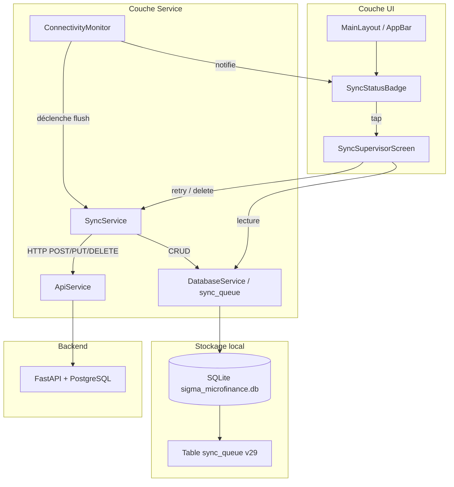
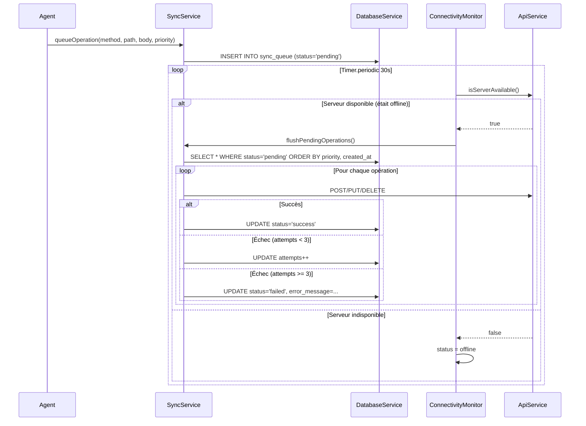

# Document de Conception — Système de Synchronisation Offline/Online

## Overview

Ce document décrit la conception technique du système de synchronisation offline/online pour SIGMA Micro-Finance. L'objectif est de remplacer la file SharedPreferences par une table SQLite robuste, d'ajouter un monitoring automatique de la connexion, un indicateur visuel permanent dans l'interface, et un écran de supervision complet.

**Stratégie de synchronisation :** Server is Truth — le serveur FastAPI est l'autorité de référence. Les opérations locales sont envoyées au serveur dans l'ordre de priorité puis par horodatage. En cas de conflit (last-write-wins basé sur le timestamp de l'opération), le serveur rejette ou accepte l'opération et le client met à jour son cache SQLite.

**Dépendances existantes utilisées :**
- `sqflite ^2.4.2` + `sqflite_common_ffi` — base SQLite locale
- `http ^1.2.2` — appels HTTP vers FastAPI via `ApiService`
- `path_provider ^2.1.5` — chemin de la base

**Détection de connexion :** pas de `connectivity_plus` ; on utilise `ApiService().isServerAvailable()` (GET /health, timeout 3 s) via un `Timer.periodic` en arrière-plan.

---

## Architecture



### Flux offline → online



---

## Components and Interfaces

### 1. `SyncQueueEntry` (modèle)

```dart
// lib/models/sync_queue_entry.dart
class SyncQueueEntry {
  final int? id;
  final String method;       // 'POST' | 'PUT' | 'DELETE'
  final String path;         // ex: '/clients/42'
  final Map<String, dynamic>? body;
  final String timestamp;    // ISO 8601 de la création de l'opération
  final int priority;        // 1 (haute) → 5 (basse)
  int attempts;              // nombre de tentatives
  String status;             // 'pending' | 'syncing' | 'success' | 'failed'
  String? errorMessage;
  final String createdAt;    // ISO 8601, insertion en base

  // fromMap / toMap pour SQLite
}
```

### 2. `SyncService` (refactorisé)

```dart
// lib/core/services/sync_service.dart
class SyncService {
  // Singleton
  
  /// Ajoute une opération dans sync_queue avec la priorité déduite du chemin.
  Future<void> queueOperation({
    required String method,
    required String path,
    Map<String, dynamic>? body,
    int? priority, // si null, déduit automatiquement depuis path
  });

  /// Retourne le nombre d'entrées en statut 'pending' ou 'syncing'.
  Future<int> getPendingCount();

  /// Retourne toutes les entrées pour l'écran de supervision.
  Future<List<SyncQueueEntry>> getAllEntries();

  /// Envoie toutes les entrées 'pending' au serveur par ordre de priorité.
  Future<SyncResult> flushPendingOperations();

  /// Remet une entrée 'failed' en 'pending' avec attempts=0 et déclenche flush.
  Future<void> retryEntry(int id);

  /// Supprime définitivement une entrée de la sync_queue.
  Future<void> deleteEntry(int id);

  /// Calcule la priorité à partir du chemin API.
  int _priorityFromPath(String path);
}

class SyncResult {
  final bool success;
  final int synced;
  final int failed;
}
```

### 3. `ConnectivityMonitor`

```dart
// lib/core/services/connectivity_monitor.dart
class ConnectivityMonitor {
  // Singleton

  /// Démarre le polling toutes les 30 secondes.
  void start();

  /// Arrête le Timer et libère les ressources.
  void dispose();

  /// Status courant exposé comme ValueNotifier.
  ValueNotifier<ConnectivityStatus> get statusNotifier;

  /// Stream de changements de statut.
  Stream<ConnectivityStatus> get statusStream;
}

enum ConnectivityStatus { online, offline, syncing }
```

### 4. `SyncStatusBadge` (widget)

```dart
// lib/widgets/sync_status_badge.dart
class SyncStatusBadge extends StatelessWidget {
  // S'abonne au ConnectivityMonitor.statusNotifier et au getPendingCount()
  // Affiche : icône colorée + label + badge numérique si pending > 0
  // Responsive : label masqué si largeur < 800px
  // onTap → navigation vers SyncSupervisorScreen
}
```

### 5. `SyncSupervisorScreen`

```dart
// lib/screens/sync/sync_supervisor_screen.dart
class SyncSupervisorScreen extends StatefulWidget {
  // Liste les SyncQueueEntry via SyncService.getAllEntries()
  // Actions par entrée : retry (si failed), delete (avec confirmation)
  // Bouton global : "Tout synchroniser"
  // Écoute le statusNotifier pour rafraîchir en temps réel
}
```

---

## Data Models

### Table `sync_queue` (migration v29)

```sql
CREATE TABLE sync_queue (
  id              INTEGER PRIMARY KEY AUTOINCREMENT,
  method          TEXT NOT NULL,          -- 'POST', 'PUT', 'DELETE'
  path            TEXT NOT NULL,          -- chemin API ex: '/clients/42'
  body            TEXT,                   -- JSON sérialisé du corps de la requête
  timestamp       TEXT NOT NULL,          -- horodatage de l'opération (ISO 8601)
  priority        INTEGER NOT NULL DEFAULT 5,  -- 1=haute, 5=basse
  attempts        INTEGER NOT NULL DEFAULT 0,
  status          TEXT NOT NULL DEFAULT 'pending',
  error_message   TEXT,
  created_at      TEXT NOT NULL           -- horodatage d'insertion en base (ISO 8601)
);

-- Index pour accélérer le flush et la supervision
CREATE INDEX idx_sync_queue_status_priority
  ON sync_queue(status, priority, created_at);
```

### Migration `DatabaseService` (v28 → v29)

```dart
if (oldVersion < 29) {
  await db.execute('''
    CREATE TABLE sync_queue (
      id            INTEGER PRIMARY KEY AUTOINCREMENT,
      method        TEXT NOT NULL,
      path          TEXT NOT NULL,
      body          TEXT,
      timestamp     TEXT NOT NULL,
      priority      INTEGER NOT NULL DEFAULT 5,
      attempts      INTEGER NOT NULL DEFAULT 0,
      status        TEXT NOT NULL DEFAULT 'pending',
      error_message TEXT,
      created_at    TEXT NOT NULL
    )
  ''');
  await db.execute('''
    CREATE INDEX idx_sync_queue_status_priority
      ON sync_queue(status, priority, created_at)
  ''');
  // Migrer les opérations existantes depuis SharedPreferences
  // (migration one-shot, puis nettoyage de la clé SharedPreferences)
}
```

### Table de priorités

| Préfixe de chemin                              | Priorité |
|------------------------------------------------|----------|
| `/remboursements`, `/echeanciers`              | 1        |
| `/operations_caisse`, `/clotures_caisse`       | 2        |
| `/prets`, `/demandes_pret`                     | 3        |
| `/clients`, `/groupes`                         | 4        |
| `/comptes_epargne`, `/transactions_epargne`    | 5        |
| Tout autre chemin                              | 5        |

### `ConnectivityStatus` (énumération)

```dart
enum ConnectivityStatus {
  online,   // serveur disponible, sync_queue vide ou non
  offline,  // serveur indisponible
  syncing,  // flush en cours
}
```

---

## Correctness Properties

*Une propriété est une caractéristique ou un comportement qui doit être vrai pour toutes les exécutions valides d'un système — en substance, une affirmation formelle sur ce que le système doit faire. Les propriétés servent de pont entre les spécifications lisibles par l'homme et les garanties de correction vérifiables par machine.*

### Property 1: Insertion en file préserve les données de l'opération

*Pour toute* opération valide (method, path, body, priority), lorsqu'elle est insérée dans la `sync_queue` via `SyncService.queueOperation()`, la relecture de cette entrée en base doit retourner exactement les mêmes valeurs de method, path, body et priority, avec le statut `pending`.

**Validates: Requirements 1.2**

### Property 2: Mappage path vers priorité est total et déterministe

*Pour tout* chemin API (path) non vide, `SyncService._priorityFromPath(path)` doit retourner une valeur entière comprise entre 1 et 5 inclus, et deux appels successifs avec le même chemin doivent toujours retourner la même priorité.

**Validates: Requirements 1.3**

### Property 3: Escalade vers failed après 3 tentatives

*Pour toute* `SyncQueueEntry` en statut `pending`, si le serveur retourne une erreur lors de 3 tentatives de flush consécutives, le statut final de l'entrée doit être `failed` et le compteur de tentatives doit être égal à 3.

**Validates: Requirements 1.4**

### Property 4: Cohérence de getPendingCount

*Pour tout* état de la `sync_queue`, `SyncService.getPendingCount()` doit retourner une valeur égale au nombre exact de lignes dont le statut est `pending` ou `syncing` dans la base SQLite.

**Validates: Requirements 1.5**

### Property 5: Suppression définitive d'une entrée

*Pour toute* `SyncQueueEntry` existante dans la `sync_queue`, après appel de `SyncService.deleteEntry(id)`, une requête `SELECT` avec ce même `id` doit retourner zéro résultat.

**Validates: Requirements 1.6**

### Property 6: Déclenchement du flush à la reconnexion

*Pour toute* séquence où le `ConnectivityMonitor` observe un statut `offline` suivi d'un retour `true` de `isServerAvailable()`, `flushPendingOperations()` doit être appelé exactement une fois par transition offline→online.

**Validates: Requirements 2.2**

### Property 7: Indisponibilité produit le statut offline

*Pour toute* réponse `false` de `isServerAvailable()` (ou exception levée), le `ConnectivityStatus` exposé par `ConnectivityMonitor` doit être `offline`.

**Validates: Requirements 2.3, 2.7**

### Property 8: Pas de flush concurrent

*Pour tout* état où `ConnectivityMonitor` est déjà en statut `syncing`, un nouveau tick du timer ne doit pas déclencher un second appel concurrent à `flushPendingOperations()`.

**Validates: Requirements 2.5**

### Property 9: Rendu du badge cohérent avec l'état

*Pour toute* combinaison de `ConnectivityStatus` et de nombre d'opérations `pending`, le widget `SyncStatusBadge` doit afficher la couleur, l'icône et le texte conformes à la table de correspondance définie (vert/En ligne, rouge/Hors ligne, orange/Sync…), et afficher le badge numérique si et seulement si le status est `offline` et pending > 0.

**Validates: Requirements 3.2, 3.3**

### Property 10: Rendu responsive du badge

*Pour toute* largeur de contexte de rendu, si la largeur est inférieure à 800 pixels, le widget `SyncStatusBadge` ne doit pas afficher de label textuel ; si la largeur est supérieure ou égale à 800 pixels, le label doit être présent.

**Validates: Requirements 3.6**

### Property 11: Tri de la liste de supervision

*Pour toute* liste de `SyncQueueEntry` retournée par `SyncService.getAllEntries()`, les entrées doivent être ordonnées par `priority` croissant d'abord, puis par `created_at` croissant pour les priorités égales.

**Validates: Requirements 4.1**

### Property 12: Retry remet l'entrée en état initial

*Pour toute* `SyncQueueEntry` en statut `failed`, après appel de `SyncService.retryEntry(id)`, le statut de l'entrée doit être `pending` et le compteur de tentatives doit être 0.

**Validates: Requirements 4.3**

### Property 13: Affichage complet des métadonnées en supervision

*Pour toute* `SyncQueueEntry`, le widget de rendu dans `SyncSupervisorScreen` doit afficher method, path, created_at, priority, attempts et status. Si `error_message` est non nul et le statut est `failed`, le message d'erreur doit également apparaître.

**Validates: Requirements 4.2, 4.5**

---

## Error Handling

### Erreurs de flush

| Situation | Comportement |
|-----------|-------------|
| Serveur indisponible au début du flush | Flush annulé, statut reste `pending`, `ConnectivityStatus` → `offline` |
| Timeout HTTP sur une opération | `attempts++`, si `attempts >= 3` → `failed` avec `error_message = 'Timeout'` |
| Réponse HTTP 4xx (ex: 404, 409) | `attempts` mis à 3 directement → `failed` avec le corps de la réponse comme `error_message` |
| Réponse HTTP 5xx | `attempts++`, retry possible lors du prochain flush |
| Exception Dart pendant le flush | Opération marquée en erreur, les autres opérations continuent |

### Rationale pour les erreurs 4xx

Une erreur 4xx (ex: 404 Not Found, 409 Conflict) indique que la requête elle-même est incorrecte ou conflictuelle. La réessayer automatiquement serait inutile et potentiellement dangereuse. L'entrée est donc immédiatement marquée `failed` pour nécessiter une intervention humaine.

### Migration depuis SharedPreferences

Lors de la migration v28→v29, les opérations stockées dans `SharedPreferences` sous la clé `pending_sync_operations` sont lues, transformées en `SyncQueueEntry` (priority=5, attempts=0, status='pending') et insérées dans `sync_queue`. La clé SharedPreferences est ensuite supprimée. Cette migration est one-shot et idempotente (vérification d'existence de la table avant migration).

---

## Testing Strategy

### Approche duale

**Tests unitaires et d'intégration :** couvrent les comportements spécifiques, les cas limites, et les interactions avec la base SQLite.

**Tests basés sur les propriétés (property-based testing) :** valident les propriétés universelles définies dans la section Propriétés de Correction ci-dessus, en générant des entrées aléatoires via le package `fast_check` ou équivalent Dart.

### Bibliothèque PBT choisie

**`dart_test` + générateurs manuels** : Dart ne dispose pas encore d'une bibliothèque PBT mature aussi complète que QuickCheck. La stratégie est d'utiliser `flutter_test` avec des générateurs de données aléatoires implémentés manuellement (boucles de 100 itérations avec `Random`), ce qui est standard dans l'écosystème Flutter pour les property tests.

Chaque test de propriété est exécuté avec **minimum 100 itérations** et est annoté d'un tag de la forme :
`// Feature: sync-offline-online, Property N: <texte de la propriété>`

### Tests unitaires prioritaires

- `SyncService.queueOperation()` → vérifier insertion, statut, timestamp
- `SyncService._priorityFromPath()` → vérifier tous les préfixes et cas par défaut
- `SyncService.flushPendingOperations()` → mock ApiService, vérifier la mise à jour des statuts
- `SyncService.retryEntry()` → vérifier reset de status et attempts
- `ConnectivityMonitor` → mock ApiService, tester les transitions de statut
- `SyncStatusBadge` → widget tests avec différentes combinaisons (status, pendingCount, width)
- `SyncSupervisorScreen` → widget tests pour le tri, l'affichage vide, le retry, la suppression

### Tests d'intégration

- Migration v28→v29 avec données SharedPreferences existantes
- Flush complet d'une queue mixte (pending, failed, success) avec serveur mocké
- Navigation SyncStatusBadge → SyncSupervisorScreen

### Couverture des propriétés

| Propriété | Type de test | Iterations |
|-----------|-------------|------------|
| P1 : Insert round-trip | Property | 100 |
| P2 : Priority mapping | Property | 100 |
| P3 : Escalade failed | Property | 100 |
| P4 : getPendingCount cohérence | Property | 100 |
| P5 : Suppression définitive | Property | 100 |
| P6 : Flush à reconnexion | Property | 100 |
| P7 : offline sur indisponibilité | Property | 100 |
| P8 : Pas de flush concurrent | Property | 100 |
| P9 : Rendu badge | Property | 100 |
| P10 : Badge responsive | Property | 100 |
| P11 : Tri supervision | Property | 100 |
| P12 : Retry reset | Property | 100 |
| P13 : Affichage métadonnées | Property | 100 |
